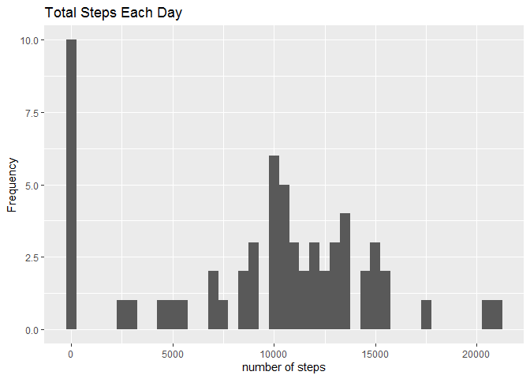
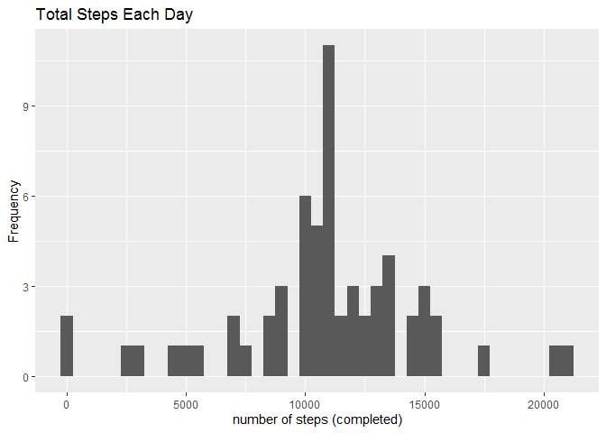
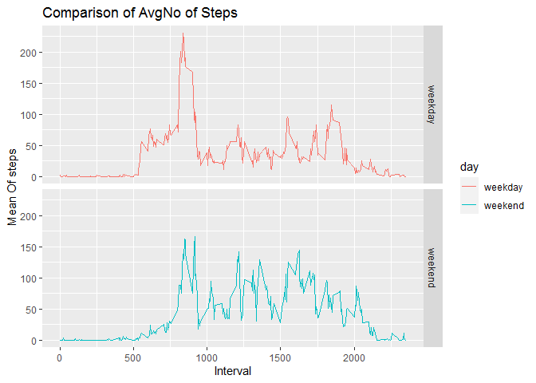

## Loading and preprocessing the data

```r
if(!file.exists('activity.csv')){
unzip('activity.zip')
}
actData <- read.csv('activity.csv')
head(actData)
```

```
##   steps       date interval
## 1    NA 2012-10-01        0
## 2    NA 2012-10-01        5
## 3    NA 2012-10-01       10
## 4    NA 2012-10-01       15
## 5    NA 2012-10-01       20
## 6    NA 2012-10-01       25
```
## What is mean total number of steps taken per day?
<h3>total number of steps taken per day<h3>

```r
ttlsteps <- tapply(actData$steps, actData$date, FUN=sum, na.rm=TRUE)
```
<h3>plotting the total steps taken per day</h3>

```r
qplot(ttlsteps, binwidth=500, xlab=" number of steps ",ylab = "Frequency",main = "Total Steps Each Day")
```

<!-- -->
<h3>Calculating mean and median  total number of steps taken per day</h3>

```r
m1 <- mean(ttlsteps)
m1
```

```
## [1] 9354.23
```

```r
med1 <- median(ttlsteps)
med1
```

```
## [1] 10395
```

## What is the average daily activity pattern?

```r
avg <- aggregate(x=list(steps=actData$steps), by=list(interval=actData$interval),FUN=mean, na.rm=TRUE)
```
## Time series plot

```r
ggplot(data=avg, aes(x=interval, y=steps)) +geom_line() +labs(x="5-minute interval",y="average number of steps taken")
```

<!-- -->

```r
avg[which.max(avg$steps),]
```

```
##     interval    steps
## 104      835 206.1698
```
<h2>Imputing missing values</h2>
<h3> Calculating  missing values</h3>

```r
missVals <- length(is.na(actData$steps))
missVals
```

```
## [1] 17568
```
<h3> Filling missing values</h3>

```r
##function to fill
fill <- function(steps, interval) {
f <- NA
if (!is.na(steps))
f <- c(steps)
else
f <- (avg[avg$interval==interval, "steps"])
return(f)
}
  
actDataImp <- actData
actDataImp$steps <- mapply(fill,actDataImp$steps,actDataImp$interval)
head(actDataImp)
```

```
##       steps       date interval
## 1 1.7169811 2012-10-01        0
## 2 0.3396226 2012-10-01        5
## 3 0.1320755 2012-10-01       10
## 4 0.1509434 2012-10-01       15
## 5 0.0754717 2012-10-01       20
## 6 2.0943396 2012-10-01       25
```

```r
ttlsteps <- tapply(actDataImp$steps, actDataImp$date, FUN=sum)
head(ttlsteps)
```

```
## 2012-10-01 2012-10-02 2012-10-03 2012-10-04 2012-10-05 2012-10-06 
##   10766.19     126.00   11352.00   12116.00   13294.00   15420.00
```
<h3>ploting the completed data</h3>

```r
qplot(ttlsteps, binwidth=500, xlab=" number of steps (completed) ",ylab = "Frequency",main = "Total Steps Each Day")
```

<!-- -->
<h3>Calculating mean and median of the completed data</h3>

```r
mean(ttlsteps)
```

```
## [1] 10766.19
```

```r
median(ttlsteps)
```

```
## [1] 10766.19
```
## Are there differences in activity patterns between weekdays and weekends?

```r
weekdayrweekend <- function(date) {
  day <- weekdays(date)
  if (day %in% c("Monday", "Tuesday", "Wednesday", "Thursday", "Friday"))
    return("weekday")
  else if (day %in% c("Saturday", "Sunday"))
    return("weekend")
  else
    stop("invalid date")
}
actDataImp$date <- as.Date(actDataImp$date)
actDataImp$day <- sapply(actDataImp$date, FUN=weekdayrweekend)
```
 <h3>Time serie plot </h3>

```r
wkndd <- aggregate(steps ~ interval + day, data=actDataImp, mean)
ggplot(wkndd, aes(interval, steps, color=day)) + geom_line() + facet_grid(day ~ .) +labs(x="Interval", y="Mean Of steps")+ggtitle("Comparison of AvgNo of Steps ")
```

<!-- -->
   From the plot,we can say that people tend to walk less on weekend than on weekdays.
